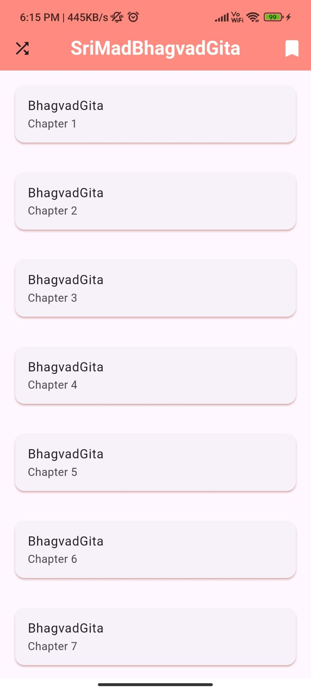
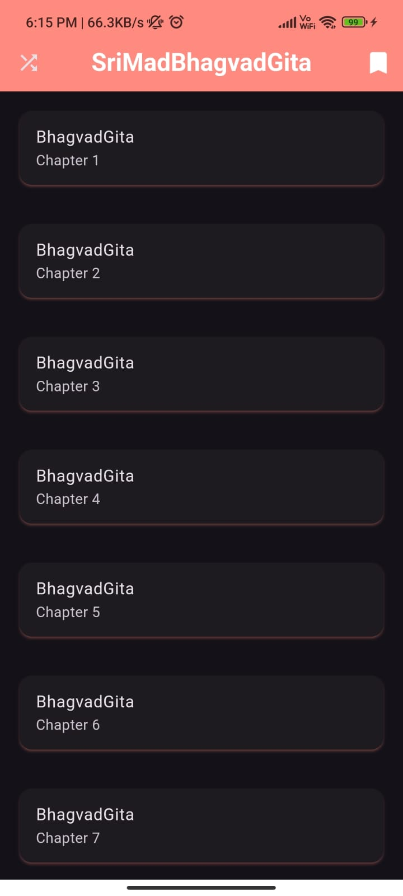
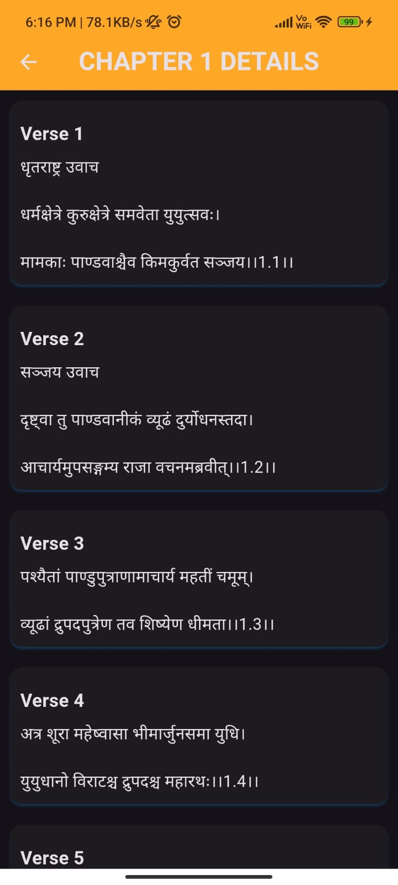
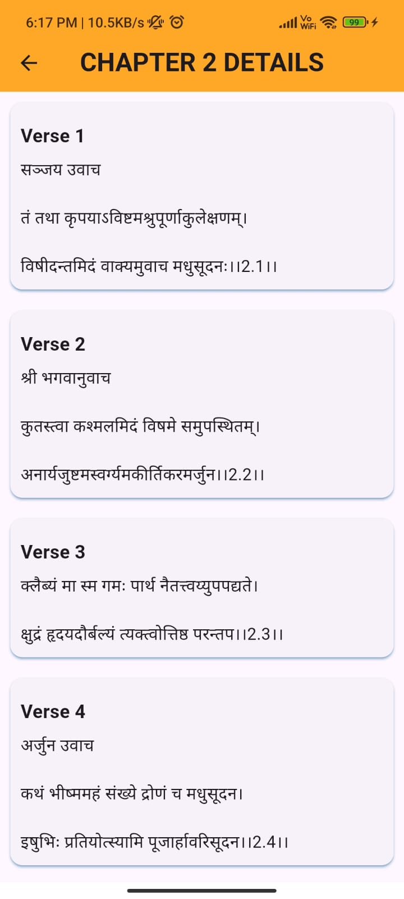
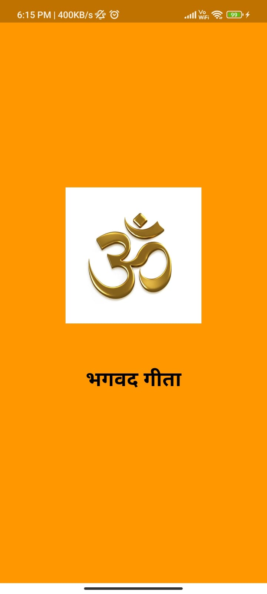
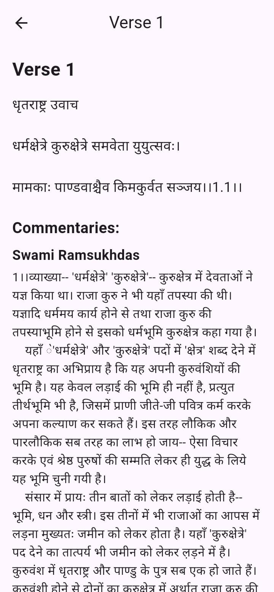

📚 Departure - Bhagavad Gita Mobile App

🔄 Project Overview

Departure is a mobile application designed to provide a seamless and enriching experience for studying and exploring the teachings of the Bhagavad Gita. Built using Flutter, the app incorporates various modern mobile development techniques such as local JSON storage and Shared Preferences to enhance usability and personalization.

Screenshots 📸

✨ Features

📖 Comprehensive Study Tool: Access all chapters and verses of the Bhagavad Gita in a structured format.

💾 Local JSON Bank: Ensures smooth performance and offline access to content.

🔐 Shared Preferences: Saves user preferences for a personalized experience.

🌟 Themes & Customization: Light and dark mode options for comfortable reading.

📒 Detailed Verse Screens: Each verse is displayed with transliterations, translations, and commentary.

🌐 Multi-Language Support: Available in multiple languages to reach a diverse audience.

➡ Smooth Navigation: Intuitive UI to help users easily browse and explore the teachings.

💻 Technology Stack

Framework: Flutter

State Management: Provider / Riverpod (or preferred Flutter state management technique)

Storage: Local JSON, Shared Preferences

UI/UX: Material Design, Custom Themes

⚙ Installation & Setup

Clone the repository:

git clone https://github.com/yourusername/departure.git

Navigate to the project directory:

cd departure

Install dependencies:

flutter pub get

Run the application:

flutter run

👥 Contributing

We welcome contributions to improve the Departure app! Feel free to fork the repository and submit pull requests with enhancements or bug fixes.
